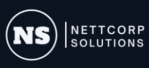

Bem-vindo ao NettCorpSolutions! Este projeto é uma plataforma completa para usuários que desejam solicitar desenvolvimento ou manutenção de sites, além de outros serviços relacionados à web. Nossa solução oferece uma interface amigável e um backend robusto para gerenciar todas as solicitações de forma eficiente.

## Visão Geral do Projeto

NettCorpSolutions é projetado para facilitar a comunicação entre clientes e desenvolvedores, permitindo que os usuários enviem solicitações de serviço, acompanhem o progresso e interajam com a equipe de suporte. A plataforma é composta por um frontend interativo e um backend poderoso.

## Frontend

### Tecnologias Utilizadas

- **React**: Biblioteca principal para construção da interface.
- **React Router**: Para navegação entre páginas.
- **Tailwind CSS**: Para estilização rápida e responsiva.
- **FontAwesome**: Para ícones.
- **AOS (Animate On Scroll)**: Para animações de rolagem.
- **Lottie**: Para animações vetoriais.
- **PrimeReact**: Componentes UI ricos.

### Funcionalidades

- **Interface de Usuário Intuitiva**: Design moderno e responsivo.
- **Formulário de Solicitação de Serviço**: Permite que os usuários enviem detalhes sobre suas necessidades.
- **Sistema de Notificações**: Mantém os usuários informados sobre o status de suas solicitações.

### Instalação

1. Clone o repositório do frontend.
2. Instale as dependências com `npm install`.
3. Inicie o servidor de desenvolvimento com `npm start`.

## Backend

### Tecnologias Utilizadas

- **Node.js**: Plataforma de execução do JavaScript no servidor.
- **Express**: Framework para construção de APIs.
- **MongoDB**: Banco de dados NoSQL.
- **Mongoose**: ODM para MongoDB.
- **JWT**: Para autenticação baseada em tokens.
- **Nodemailer**: Para envio de emails.

### Funcionalidades

- **Gerenciamento de Usuários**: Registro, login e autenticação segura.
- **Processamento de Solicitações**: Criação, atualização e acompanhamento de solicitações de serviço.
- **Envio de Emails**: Notificações automáticas para os usuários.

### Instalação

1. Clone o repositório do backend.
2. Instale as dependências com `npm install`.
3. Configure as variáveis de ambiente no arquivo `.env`.
4. Inicie o servidor com `npm run dev`.

<!-- ## Contribuição

Contribuições são bem-vindas! Sinta-se à vontade para abrir issues e pull requests para melhorias e correções.

## Licença

Este projeto está licenciado sob a licença MIT.

## Contato

Para mais informações, entre em contato conosco através do email: contato@nettcorpsolutions.com -->
